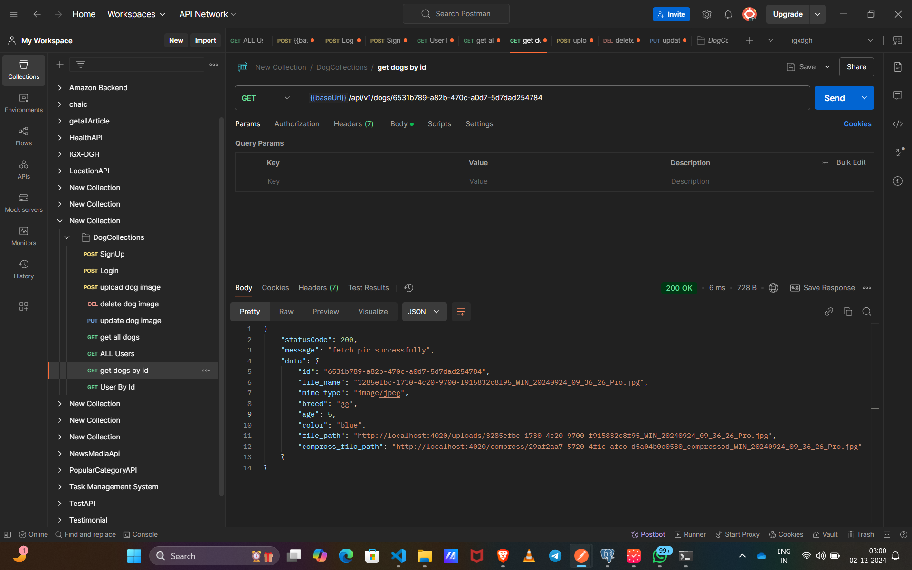

# Hi Reviewer,I have completed the task .Please Review My Code and Please check the code quality once and i have also implemented dynamic error and responses have a look at my code And Please give me a feedback so that i can improve my code quality more.I have tried my best although i m not be able to write a suite of tests but in future if it need i will try to learn and implement the same 
Due to not any constraints of framework i have prefer to use NestJs to build the restful Api and for the backend i have used postgresSQL and sequelizeORM for object relational mapping and Typescript and one more thing due to time constraints i have used help of ai to generate a readMe and one more last thing i have used Sharp for compressing image 

inside public/originalImage
        public/compressImage

Thanks for reading and Have a good day.

# Dog Image Uploader 

# Overview
This is a RESTful API built using NestJS for uploading and managing dog pictures. The API supports several operations such as uploading, deleting, updating, and retrieving dog images, along with metadata like breed, age, and color.

The API also includes basic authentication and authorization features to ensure secure access.

# Features
Upload a Dog Picture: Allows users to upload a dog picture along with metadata such as breed, age, and color.
Delete a Dog Picture: Allows users to delete a dog picture by its ID.
Update a Dog Picture: Allows users to replace an existing dog picture with a new one (including metadata updates).
Get a Dog Picture by ID: Retrieve a specific dog picture by its ID.
Get All Dog Pictures: Fetch all uploaded dog pictures.
Authentication: Secure endpoints for login using username and password.
Role-Based Authorization: Only admin users can view, update, or delete dog pictures.
# Tried to implement a docker and to dockerize my application but not able to do at the moment
# Done Correctly use HTTP response codes, including error handling.
# Upload a dog pic.
# Delete a dog pic.
# Update a previously uploaded dog pic (not just metadata) in place.
# Fetch a particular dog image file by its ID
# Fetch a list of the uploaded dog pics.
Endpoints
# Upload a Dog Picture
# Get all user api
# Get user api 
POST /upload
 for post Api:-{{baseUrl}}/api/v1/dogs/upload
 
Request Body:

file: The image file to be uploaded (Multer file type).
breed: Dog's breed (string).
age: Dog's age (number).
color: Dog's color (string).
Response:

originImage: URL of the original image.
compressImage: URL of the compressed image.
# Get All Dog Pictures
GET /  {{baseUrl}}/api/v1/users/

Authorization: Requires ADMIN role.
Response: A list of all dog pictures with metadata.
# Get Dog Picture by ID
GET /:id
{{baseUrl}}/api/v1/dogs/:id
<!-- {{baseUrl}}/api/v1/dogs/6531b789-a82b-470c-a0d7-5d7dad254784 -->

Request Parameters:

id: The ID of the dog picture.
Response: The dog picture with metadata, including URLs for the original and compressed image.

# Delete a Dog Picture
DELETE /:id

{{baseUrl}}/api/v1/dogs/:id
<!-- {{baseUrl}}/api/v1/dogs/347c9622-9b7d-4cf9-8b8c-5cb72f4a6c97 -->

Request Parameters:

id: The ID of the dog picture to delete.
Response: Confirmation message indicating the image was deleted.

# Update a Dog Picture
PUT /:id
{{baseUrl}}/api/v1/dogs/6531b789-a82b-470c-a0d7-5d7dad254784

Request Parameters:

id: The ID of the dog picture to update.
Request Body:

file: The new image file to be uploaded (Multer file type).
breed: New breed (string).
age: New age (number).
color: New color (string).
Response:

originImage: URL of the updated original image.
compressImage: URL of the updated compressed image.
6. Login
POST /auth

Request Body:

userName: The username of the user.
password: The password of the user.
Response: Authentication token and user details.
# Signup

Setup Instructions
Prerequisites
Node.js (v18 or higher)
npm (v8 or higher)
Docker (optional, for containerized setup)
1. Clone the Repository
bash
Copy code
git clone <repository-url>
cd <project-directory>
2. Install Dependencies
bash
Copy code
npm install
3. Set Environment Variables
Create a .env file in the root of the project with the following values:

bash
Copy code
PORT=4020
JWT_SECRET=your-jwt-secret
DATABASE_URL=your-database-url
4. Run the Application
bash
Copy code
npm run start
The API will be available at http://localhost:4020.

5. Run with Docker (optional)
bash
Copy code
docker-compose up --build
This will build and start the application inside a Docker container.

Install Testing Dependencies:
bash
Copy code
npm install --save-dev @nestjs/testing jest ts-jest
Run Tests:
bash
Copy code
npm run test
Tests cover the following:

Image upload functionality.
Image retrieval by ID.
Image deletion by ID.
Image update functionality.
Authentication endpoints.
Error Handling
The API uses HTTP status codes to indicate the outcome of each request. Below are the possible error scenarios:

400 Bad Request: Returned when invalid data is provided (e.g., missing file or invalid ID).
401 Unauthorized: Returned when the user is not authenticated.
403 Forbidden: Returned when the user does not have permission to access a resource.
404 Not Found: Returned when an image or user is not found.
500 Internal Server Error: Returned for unexpected server issues.
Error Examples
File Not Found Error: Returned when no file is provided for an upload or update.
Image Not Found Error: Returned when the image by the given ID does not exist in the database.
Example Usage
Uploading a Dog Picture
bash
Copy code
POST /upload
Content-Type: multipart/form-data
{
  "file": "<image-file>",
  "breed": "Labrador",
  "age": 3,
  "color": "Yellow"
}
Response:

json
Copy code
{
  "originImage": "http://localhost:4020/uploads/original-image.jpg",
  "compressImage": "http://localhost:4020/compress/compressed-image.jpg"
}
Getting a Dog Picture by ID
bash
Copy code
GET /:id
Response:

json
Copy code
{
  "id": 1,
  "file_name": "original-image.jpg",
  "breed": "Labrador",
  "age": 3,
  "color": "Yellow",
  "file_path": "http://localhost:4020/uploads/original-image.jpg",
  "compress_file_path": "http://localhost:4020/compress/compressed-image.jpg"
}
